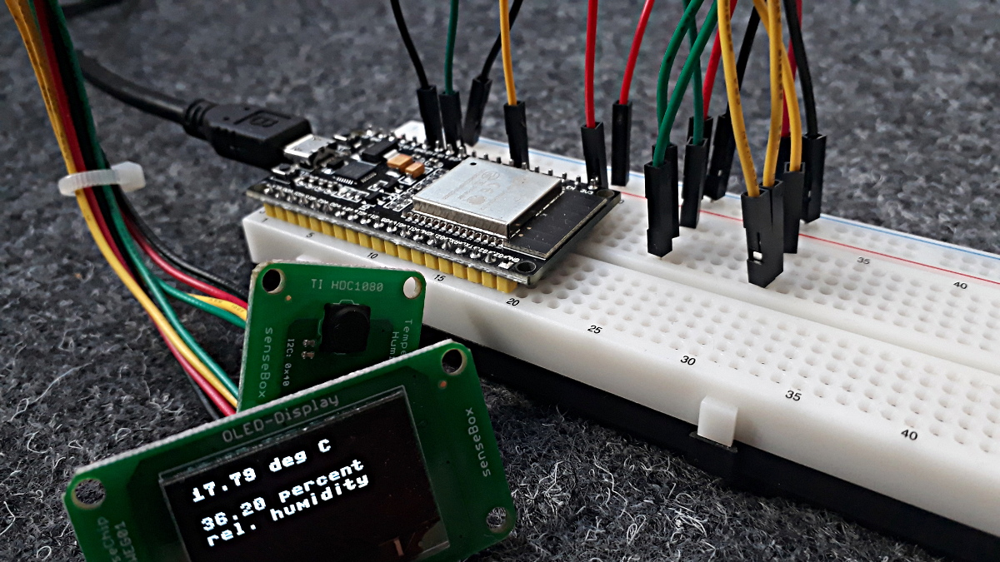

# Getting started with micropython

Micropyhton is a python interpreter that runs on a microcontroller. The code in this repository was tested with the ESP32-DevKitC V4 board by Espressif. Flashing was done on a Linux Laptop.

## Official documentation

The best way to start with micropyhon and the ESP32 chip, is the official micropython documentation:

http://docs.micropython.org/en/latest/esp32/tutorial/intro.html#esp32-intro

Here, you find a quick summary:

## Installing the python interpreter

1. Get the `esptool` by espressiv (Install a modern python version first, to have `pip` available at the command line):

```
pip install esptool
```

2. Connect the ESP32 board and your PC with a USB-cable and find out to which serial port the board connects to. This may be something like `/dev/ttyUSB0` on Linux or `COM4` on Windows.

3. Erase the flash:

```
esptool.py --port /dev/ttyUSB0 erase_flash
```

(Change the port name accordingly.)

4. Download the micropython interpreter: https://micropython.org/download#esp32

5. Deploy the interpreter:

```
esptool.py --chip esp32 --port /dev/ttyUSB0 write_flash -z 0x1000 esp32-20190529-v1.11.bin
```
(Change the file name to the one you downloaded.)

##  Interactive Terminal

Use any terminal emulation programme for serial communication like `picocom` or `minicom` to get to the interactive prompt of your micropython interpreter. For example:

```
picocom /dev/ttyUSB0 -b115200
```

Press `Enter` once or twice until you get the prompt.

```
>>>
```

Now, type something pythonic, e.g.:

```python
>>> [x**2 for m in range(10)]
```
## Run a test script

Copy the following code into a file and save it as `main.py`. The code is switching the internal LED on and off.

```python
from machine import Pin
from time import sleep

pin = Pin(1)
pin.init(Pin.OUT)

while True:
    pin.on()
    sleep(1)
    pin.off()
    sleep(1)
```

For flashing `main.py`, install the remote micropython shell `rshell`:

```
pip install rshell
```
Execute:

```
rshell -p /dev/ttyUSB0
```
And at the prompt:

```
cp main.py /pyboard/
```

You may press the restart button of the board to see the led blinking.

# Files in this repository

## led

Example for flashing an external LED. Connect a resistor and an LED in line between PIN 13 and GRD.

## hdc1080

Example for reading values from the humidity and temperature sensor hdc1080 and showing them on the adafruit oled display SSD1306 via I2C bus.



## ssd1306

Driver of the adafruit OLED display SSD1306.

## shower_log

Read data from a digital temperature sensor DS18D20 (OneWire bus) and a differential pressure transducer MPXV7002DP (analog input) and show the data on a display (I2C bus). This code is the basis for a simple do-it-yourself heat meter.

## log_to_raspy, log_to_scc

Send sensor data to a mqtt data broker.

## receiver

Receiving data from a mqtt data broker. Log to a file by running `python -u receiver.py >> logfile.dat`. Monitor with `tail -f logfile.dat`.

## mqtt_send_tst

Minimal example for sending data to a data broker.


