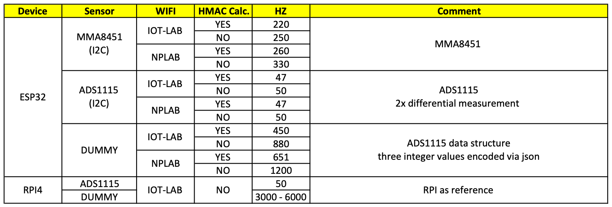

# IOT Project

## Directory Structure

* Arduino - ESP32/ESP8266 boards using the Arduino API
* MicroPython - ESP32/ESP8266 boards using MicroPython
* Python - Python based examples
* Web - Web based MQTT visualization

## Performance Evaluation

